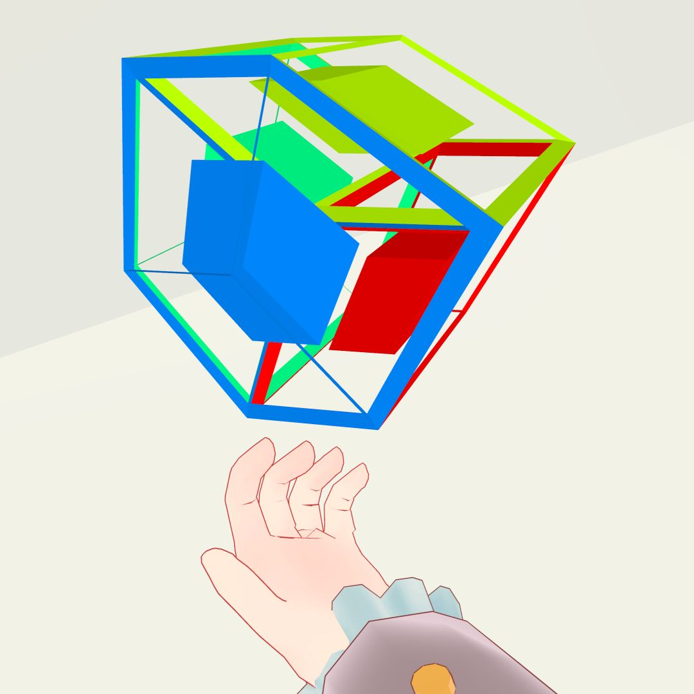
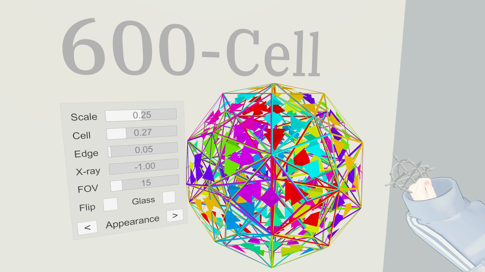
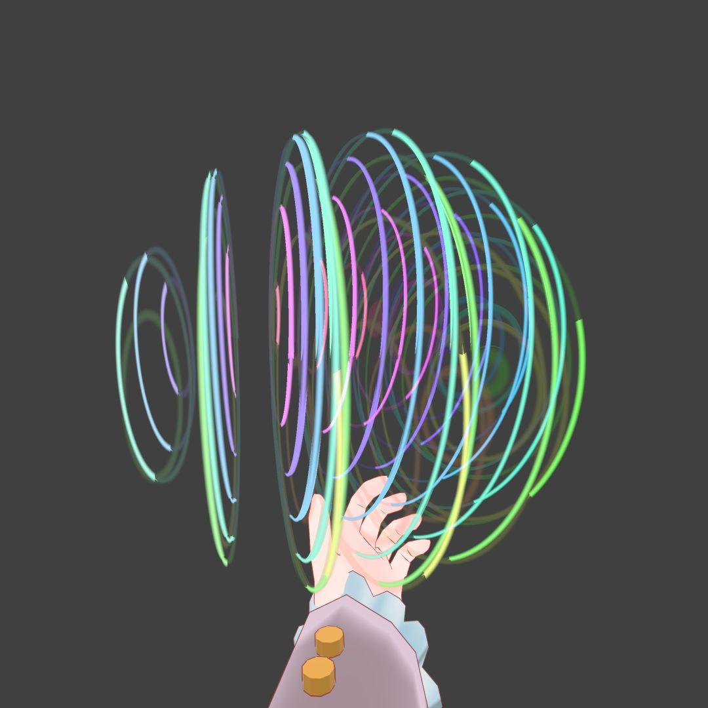

# distribution-box

These packages are licensed under CC0.

主にVRChatでの利用を想定しています。

## Polychoral Accessory

[PolychoralAccessory.unitypackage](https://github.com/dearsip/distribution-box/raw/main/PolychoralAccessory.unitypackage)

4次元座標（と法線・閾値）を持つメッシュを3次元投影で表示し、ボーン位置を入力として回転させるシェーダーです。

`PolychoralAccessory.prefab`には、VRChatアバターの手の上に表示するためのPhysBone、[Modular Avatar](https://modular-avatar.nadena.dev/ja/)及び[Avatar Menu Creator for MA](https://avatar-menu-creator-for-ma.vrchat.narazaka.net/)設定が含まれます。
`PolyhedralAccessory.prefab`は、多面体の2次元投影の表示のためにPhysBoneの挙動を制限したものです。

アルファベットと数字の組からなるメッシュ及びマテリアルは、その表記が表す対称性に基づき一つの頂点座標から多胞体を生成するもので、ボーン位置を回転の代わりに頂点座標に割り当てています。

[こちらのワールド](https://vrchat.com/home/launch?worldId=wrld_29bde305-ffb9-4b22-8369-1eccf7316fae)にサンプルアバターがあります。

## Polychora Viewer

[PolychoraViewer.unitypackage](https://github.com/dearsip/distribution-box/raw/main/PolychoraViewer.unitypackage)

VRChatワールドで4次元多胞体を描画するためのアセットです。モーションコントローラと設定ウィンドウが付属しており、ワールド内で回転操作や描画スタイル変更等ができます。状態は同期されます。

PC及びAndroid（Quest3以外未検証）に対応していますが、対応のためにはマテリアルが参照するシェーダーを変更する必要があります。[EasyQuestSwitch](https://github.com/vrchat-community/EasyQuestSwitch)の利用を推奨します。

| マテリアル | シェーダー (PC) | シェーダー (Android) |
| ---- | ---- | ---- |
| CalcDisplay | Face | FaceQuest |
| CalcEdge | Edge | EdgeQuest |
| Line | Line | EdgeQuest |

図形の情報は現状スクリプトに直接書き込まれており、プレハブの`Shape Num`で指定します。0～5が4次元正多胞体、6～10が正多面体（`PolyhedraViewer.prefab`で動作）です。

上記と同じく、アルファベットと数字の組からなるメッシュ及びマテリアルは頂点座標の変更に対応し、設定ウィンドウの反対側に表示される三角形または四面体に沿って白球を動かすことで、頂点座標を変更できます。こちらは現在色の変更及び同期には対応していません。

[上記と同じワールド](https://vrchat.com/home/launch?worldId=wrld_29bde305-ffb9-4b22-8369-1eccf7316fae)に設置しています。

## 4D SDF Slice Stacker

[4DSDFSliceStacker.unitypackage](https://github.com/dearsip/distribution-box/raw/main/4DSDFSliceStacker.unitypackage)

4変数の陰関数（特に符号付き距離関数: Signed Distance Function, SDF）で表された3次元超曲面を、格子状に並んだ2次元平面との交差として描画するシェーダーです。

`4S3_Grabbable.prefab`には、Polychoral Accessoryと同様に、VRChatアバターの手の上に表示し掴んで回転させるためのPhysBone、[Modular Avatar](https://modular-avatar.nadena.dev/ja/)設定が含まれます。
`4S3_Static.prefab`は、デスクトップでの表示のためにPhysBone設定を除き、交差法立体視描画機能を追加したものです。

`4S3_Presets.prefab`および`4S3_Custom.prefab`は、関連するExpressions Menuを追加するためのアセットです。`4S3_Presets.prefab`では、上記ワールドの展示を再現した設定を纏めています。`4S3_Custom.prefab`では、ほぼ全ての設定項目を編集できます。使用には[Avatar Menu Creator for MA](https://avatar-menu-creator-for-ma.vrchat.narazaka.net/)が必要です。両者を同時に使用することはできません。

描画にDepthテクスチャを使用するため、リアルタイムシャドウのないワールドでは表示されません。アバターに別途影を生成するライトを追加することで常に描画できるようになります。（[参考資料](https://qiita.com/yuri_tsukimi/items/721c4f49e7228c0865db)）

[こちらのワールド](https://vrchat.com/home/launch?worldId=wrld_08c252c2-fc4f-441f-93bc-c583e4054dca)に設定項目の説明及びサンプルアバターがあります。

## Floating Tool

[FloatingTool.unitypackage](https://github.com/dearsip/distribution-box/raw/main/FloatingTool.unitypackage)

ワールド用浮遊・飛行ギミックです。空中でジャンプを入力することで起動・停止し、起動中は落下しなくなります。浮遊中に、デスクトップならE/Qキー、VRなら右サムスティック上下で上下移動します。`FloatingTool.prefab`をシーンに追加することで機能します。

- `Max Speed`: 移動の最高速度。 
- `Accel`: 最高速度に到達するまでの早さ（逆数が所要時間）。速度は線形に増加する。 

[FlyingSystem](https://github.com/phi16/VRC_storage?tab=readme-ov-file#flyingsystem)のスクリプトを参考にしています。

[4D SDF Slice Stacker](https://vrchat.com/home/launch?worldId=wrld_08c252c2-fc4f-441f-93bc-c583e4054dca)に導入しています。（一部機能の追加があります）

## UI Sync

[UISync.unitypackage](https://github.com/dearsip/distribution-box/raw/main/UISync.unitypackage)

uGUIコンポーネント（Toggle、TMP_Dropdown、TMP_InputField、Slider）の値をグローバル化するU#スクリプトです。対応するスクリプト（`UISyncToggle`、`UISyncDropdown`、`UISyncInputField`、`UISyncSlider`）を、各コンポーネントを持つGameObjectにアタッチすることで機能します。

- `Request Interval`: 同期の間隔。値が連続に更新された場合はこの値ごとに`RequestSerialization()`が実行される。

`UISyncSliderLinear`は、Sliderの同期を線形補完したい（`UdonSyncMode.Linear`を使用したい）場合に`UISyncSlider`の代わりにアタッチします。

`Editor/UISyncAutoBinder`は、各コンポーネントにUdonBehaviourがアタッチされたとき、`UdonBehaviour.SendCustomEvent(OnValueChanged)`を自動で追加します。これはコンポーネントの値を同期変数に反映するための処理です。他のUdonBehaviourがアタッチされている場合、意図しない動作をする可能性があります。動作に問題がある場合は、`Editor/UISyncAutoBinder`を削除して自身で追加を行ってください。

VRChatでのuGUIの使用については[ドキュメント](https://creators.vrchat.com/worlds/components/vrc_uishape/)を参照してください。基本的には`UI/Text - TextMeshPro (VRC)`の追加と、各コンポーネントの`Navigation`を`None`にすること（加えてScroll barがある場合は`Scroll Sensitivity`を0にすること）で正常に機能するようになります。Sceneビュー上に表示されるアイコンはSceneビュー右上の"Toggle visibility of all Gizmos in the Scene view"でオフにできます。

## Camera Reflector

[CameraReflector.unitypackage](https://github.com/dearsip/distribution-box/raw/main/CameraReflector.unitypackage)

反転を含むカメラで深度バッファを参照しながらスクリーンを上書きするワールド用ギミックです。（PC Only）

ポリゴンの表裏は反転（鏡映変換）によって入れ替わります。そのため、カメラの変換行列が鏡映変換を含む場合、`GL.invertCulling=true`によって表裏判定を補正する必要があります。しかし、現在のVRChatでは`GL.invertCulling`にアクセスすることができません。代替として、変換行列を反転させてから描画し、描画結果をさらに反転させることで、求める結果を得ることができます。  
ところで、複数のカメラで同じレンダーターゲットを指定することで、先のカメラの深度バッファを参照しながら後のカメラの描画を重ねることができます。そして、例えば2台のカメラでの描画において後のカメラのみ反転を含む場合、上記の代替手法を適用するには、先のカメラでの描画結果及び深度バッファを後のカメラのために反転させる必要があります。本ギミックはそのような処理を実装したものです。

`CameraReflector.prefab`は、ワールド内のアバターをオブジェクトの位置からz軸方向に反転させて描画します。異なる用途で用いるには`CameraReflector.cs`を編集する必要があります。

- `Camera Count`: 上書きに用いるカメラの総数。
- `Camera Depth Offset`: このスクリプトで使用するカメラのDepthを設定する。`(cameraCount + 1) * 3`台のカメラが`cameraDepthOffset - (cameraCount + 1) * 3`から`cameraDepthOffset - 1`までのDepthに配置される。いずれのカメラもDepthが負である必要がある。
- `Integrate Layer`: 使用していないレイヤー（22-30）を一つ指定する。描画結果のスクリーンへの反映に用いる。
- `Depth Base Layer`: 使用するカメラが共通して描画するレイヤーを一つ指定する。深度バッファの書き込みに用いる。
- `Photo Resolution`: Photo Cameraに使用するテクスチャの解像度を指定する。`Stream`はStream Cameraの解像度、すなわちウィンドウサイズに対応する。本ギミックの描画結果は標準のPhoto Cameraには映るがその他のカメラや鏡には映らない。また、指定した解像度でのレンダリングはPhoto Cameraを表示している間毎フレーム実行される。

[こちらのワールド](https://vrchat.com/home/launch?worldId=wrld_dc61c604-638c-4832-9136-d7438a823b2e)にサンプルを設置しています。（`CameraReflectorSample.unity`とほぼ同一）